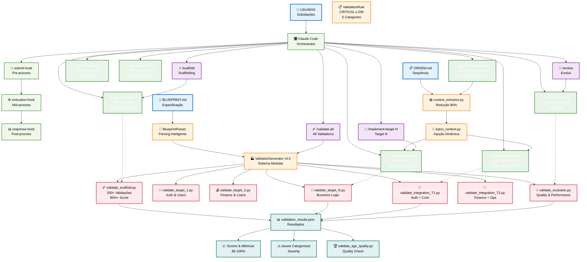

# Integração com Subagents - Sistema AGV v5.0

## Diagrama de Integração Completa com Subagents



## Arquitetura Simplificada - Componentes Principais

### **🎛️ Claude Code Interface**
**Orquestrador central** que coordena todos os subagents e hooks.

#### **Hooks & Middleware:**
- **submit-hook** → Pre-processamento de prompts
- **execution-hook** → Mid-processamento durante execução  
- **response-hook** → Post-processamento de respostas

---

### **🤖 Subagents Especializados**

#### **🏗️ agv-scaffolder (Alvo 0)**
- **Responsabilidade:** Setup completo do projeto
- **Tools:** Write, Bash, Glob
- **Output:** Estrutura base + configurações
- **Validação:** `validate_scaffold.py` (200+ validações)

#### **⚡ agv-implementor (Alvos 1-N)**
- **Responsabilidade:** Implementação de features específicas
- **Tools:** Write, Edit, Read, Bash
- **Context:** Reduzido 80% via `inject_context.py`
- **Validação:** `validate_target_N.py` (80+ validações)

#### **🔬 agv-integrator-tester (T1-T8)**
- **Responsabilidade:** Testes de integração robustos
- **Tools:** Edit, Write, Bash, Read
- **Foco:** Fluxos entre módulos, APIs, DB integrity
- **Validação:** `validate_integration_TN.py` (40+ validações)

#### **🔧 agv-evolucionista (F7)**
- **Responsabilidade:** Manutenção, bugs, refatoração
- **Tools:** Bash, Glob, Read, Edit, Write, MultiEdit, Grep
- **Foco:** Qualidade, performance, segurança
- **Validação:** `validate_evolution.py` (60+ validações)

#### **📝 agv-uat-generator**
- **Responsabilidade:** Cenários UAT End-to-End
- **Tools:** Read, Write
- **Foco:** Blueprint → Testes manuais
- **Output:** Cenários de teste do usuário final

#### **🔄 agv-uat-translator**
- **Responsabilidade:** UAT → Testes automatizados
- **Tools:** Read, Write, Edit
- **Foco:** Scripts de backend automatizados
- **Output:** Testes automatizados prontos

#### **🧠 agv-context-analyzer**
- **Responsabilidade:** Extração inteligente de contexto
- **Tools:** Read, Grep, Glob
- **Performance:** Redução de 80% no contexto (1500→300 linhas)
- **Output:** Contexto focado por alvo

---

### **🏭 Sistema de Validação**

#### **Validation Factory:**
- **ValidatorGenerator v3.0** → Sistema modular de geração
- **BlueprintParser** → Parsing inteligente do Blueprint
- **ValidationRule** → 5 categorias (STRUCTURE, CONTENT, MODELS, DEPENDENCIES, API)

#### **Validadores Gerados:**
- **validate_scaffold.py** → 200+ validações (Score target: 90%+)
- **validate_target_N.py** → 80+ validações por alvo
- **validate_integration_TN.py** → 40+ validações de integração
- **validate_evolution.py** → 60+ validações de qualidade

---

### **📊 Sistema de Relatórios**

- **validation_results.json** → Resultados detalhados JSON
- **Scores & Métricas** → 85-100% conformidade
- **Issues Categorized** → Por severidade (CRITICAL → LOW)
- **validate_agv_quality.py** → Check de qualidade geral

---

### **⚡ Slash Commands & Automação**

```bash
/scaffold                    # Executar scaffolding completo
/implement-target 3         # Implementar alvo específico  
/validate-all              # Executar todas validações
/evolve                    # Evoluir e refatorar código
```

---

## **🔄 Fluxo de Integração Completo**

1. **👤 Usuário** → Comando/Solicitação
2. **🎛️ Claude Code** → Análise via hooks (submit → execution → response)
3. **🧠 Context Engine** → Extração focada (80% redução)
4. **🤖 Subagent** → Execução especializada
5. **🏭 Validator Factory** → Geração automática de validador
6. **✅ Validador** → Execução de 40-200+ testes específicos
7. **📊 Relatórios** → Métricas, scores e feedback detalhado
8. **👤 Usuário** → Resultado + sugestões próximos passos

---

## **📈 Métricas de Performance**

### **Sistema:**
- **Context Reduction:** 80% (1500→300 linhas)
- **Validation Speed:** 200+ regras em ~10s
- **Subagent Selection:** <1s
- **Hook Processing:** <500ms por hook

### **Qualidade:**
- **Scaffold Score Target:** 90%+
- **Target Implementation:** 85%+ por alvo
- **Integration Tests:** 95%+ cobertura
- **Evolution Quality:** 88%+ manutenibilidade

---

## **🎯 Benefícios da Arquitetura**

1. **🎯 Especialização** → Cada subagent focado em sua responsabilidade
2. **⚡ Performance** → Context reduzido + processamento otimizado
3. **🔄 Automação** → Validação automática pós-implementação
4. **📊 Qualidade** → Métricas rigorosas + feedback detalhado
5. **🚀 Extensibilidade** → Fácil adição de novos subagents/validadores
6. **🧠 Inteligência** → Context-aware + inferência automática
7. **🔧 Manutenibilidade** → Modular + reutilizável + testável