# Arquitetura Completa - Sistema AGV v5.0 com Subagents

## 🏗️ Diagrama Geral da Arquitetura do Sistema AGV

```mermaid
graph TB
    subgraph "MÉTODO AGV v5.0 - SISTEMA COMPLETO"
        direction TB
        
        subgraph "ENTRADA DO SISTEMA"
            BP[BLUEPRINT_ARQUITETURAL.md<br/>Especificação Completa do Projeto]
            ORDER[ORDEM_IMPLEMENTACAO.md<br/>Sequência dos Alvos 1-N]
            USER[USUÁRIO<br/>Comandos & Solicitações]
        end
        
        subgraph "CLAUDE CODE + SUBAGENTS LAYER"
            direction LR
            CC[Claude Code<br/>Interface Principal]
            
            subgraph "SUBAGENTS ESPECIALIZADOS"
                SA1[agv-scaffolder<br/>Alvo 0: Setup Projeto]
                SA2[agv-implementor<br/>Alvos 1-N: Features]  
                SA3[agv-integrator-tester<br/>Testes Integração T1-T8]
                SA4[agv-evolucionista<br/>Manutenção & Evolução]
                SA5[agv-uat-generator<br/>Cenários UAT]
                SA6[agv-uat-translator<br/>Testes Automatizados]
                SA7[agv-context-analyzer<br/>Extração Contexto]
            end
        end
        
        subgraph "SISTEMA CENTRAL DE SCRIPTS & CORE"
            direction TB
            
            subgraph "CORE COMPONENTS"
                direction LR
                C1[blueprint_parser.py<br/>Parser Inteligente]
                C2[validation_rules.py<br/>Regras Base]
                C3[base_generator.py<br/>Gerador Base Abstrato]
            end
            
            subgraph "CONTEXT PROCESSING"
                direction LR
                CTX1[agv_context_extractor.py<br/>Extração Contexto Focado]
                CTX2[inject_focused_context.py<br/>Injeção Contexto]
            end
            
            subgraph "GERADORES ESPECIALIZADOS"
                direction LR
                GEN1[scaffold_generator.py<br/>Validação Estrutura]
                GEN2[target_generator.py<br/>Validação Alvos]
                GEN3[integration_generator.py<br/>Validação Integração]
                GEN4[evolution_generator.py<br/>Validação Evolução]
            end
            
            subgraph "SISTEMA DE VALIDAÇÃO"
                direction TB
                VG[validator_generator.py<br/>Gerador Mestre]
                VC[validation_config.py<br/>Configurações]
                QUAL[validate_agv_quality.py<br/>Qualidade AGV]
                BLUE[validate_blueprint_conformity.py<br/>Conformidade Blueprint]
            end
        end
        
        subgraph "VALIDADORES GERADOS DINAMICAMENTE"
            direction LR
            VS[validate_scaffold.py<br/>Validador Scaffold Gerado]
            VT1[validate_target_1.py<br/>Validador Alvo 1 Gerado]
            VTN[validate_target_N.py<br/>Validador Alvo N Gerado]
            VI[validate_integration_T1.py<br/>Validador Integração Gerado]
            VE[validate_evolution.py<br/>Validador Evolução Gerado]
        end
        
        subgraph "SAÍDAS & RELATÓRIOS"
            direction LR
            REP[validation_results.json<br/>Resultados Detalhados]
            SCORES[Scores & Métricas<br/>90%+ Conformidade]
            ISSUES[Issues Identificados<br/>CRITICAL/HIGH/MEDIUM/LOW]
        end
    end
    
    %% CONEXÕES PRINCIPAIS
    BP --> C1
    ORDER --> CTX1
    USER --> CC
    
    CC --> SA1
    CC --> SA2  
    CC --> SA3
    CC --> SA4
    CC --> SA5
    CC --> SA6
    CC --> SA7
    
    C1 --> GEN1
    C1 --> GEN2
    C1 --> GEN3
    C1 --> GEN4
    
    C3 --> GEN1
    C3 --> GEN2
    C3 --> GEN3
    C3 --> GEN4
    
    CTX1 --> CTX2
    CTX2 --> SA2
    CTX2 --> SA3
    
    GEN1 --> VG
    GEN2 --> VG
    GEN3 --> VG
    GEN4 --> VG
    
    VG --> VS
    VG --> VT1
    VG --> VTN
    VG --> VI
    VG --> VE
    
    VS --> REP
    VT1 --> REP
    VI --> REP
    
    SA1 -.-> VS
    SA2 -.-> VTN
    SA3 -.-> VI
    SA4 -.-> VE
    
    REP --> SCORES
    REP --> ISSUES
    
    %% STYLING
    classDef entrada fill:#E1F5FE,stroke:#0277BD,stroke-width:3px,color:#000
    classDef subagent fill:#E8F5E8,stroke:#2E7D32,stroke-width:2px,color:#000
    classDef core fill:#FFF3E0,stroke:#F57C00,stroke-width:2px,color:#000
    classDef generator fill:#F3E5F5,stroke:#7B1FA2,stroke-width:2px,color:#000
    classDef validator fill:#FFEBEE,stroke:#C62828,stroke-width:2px,color:#000
    classDef output fill:#E0F2F1,stroke:#00695C,stroke-width:2px,color:#000
    
    class BP,ORDER,USER entrada
    class SA1,SA2,SA3,SA4,SA5,SA6,SA7 subagent
    class C1,C2,C3,CTX1,CTX2,VG,VC,QUAL,BLUE core
    class GEN1,GEN2,GEN3,GEN4 generator
    class VS,VT1,VTN,VI,VE validator
    class REP,SCORES,ISSUES output
```



## 🏆 Características Principais

### 🤖 **Sistema de Subagents Especializados**
- **7 agentes especializados** para diferentes fases do AGV v5.0
- **Ferramentas específicas** por agente (Write, Edit, Read, Bash, Glob, Grep)
- **Execução autônoma** com contexto focado

### 🧬 **Parsing Inteligente de Blueprint**
- **AdvancedBlueprintParser** extrai especificações complexas
- **ProjectSpecs** com 15+ campos especializados
- **Inferência contextual** de relacionamentos e dependências

### ✂️ **Otimização de Contexto**
- **Redução de 80%** no contexto (1500+ → ~300 linhas)
- **Extração focada** por alvo específico
- **Injeção dinâmica** no prompt dos subagents

### 🏭 **Validação Dinâmica**
- **Geradores especializados** criam validadores personalizados
- **200+ validações** para scaffold, 80+ por alvo
- **Sistema de scoring** com categorização por severidade

### 📊 **Sistema de Qualidade**
- **Scores quantitativos** de conformidade (85-100%)
- **Categorização** CRITICAL|HIGH|MEDIUM|LOW
- **Relatórios detalhados** em JSON e texto

## 🎯 **Fluxo de Dados Principal**

```
Blueprint → Parser → Context Extractor → Subagent → Validator Generator → Validador Executável → Relatório Detalhado
```

Este sistema representa uma **arquitetura enterprise de alta qualidade** que automatiza completamente o processo de implementação e validação do Método AGV v5.0.