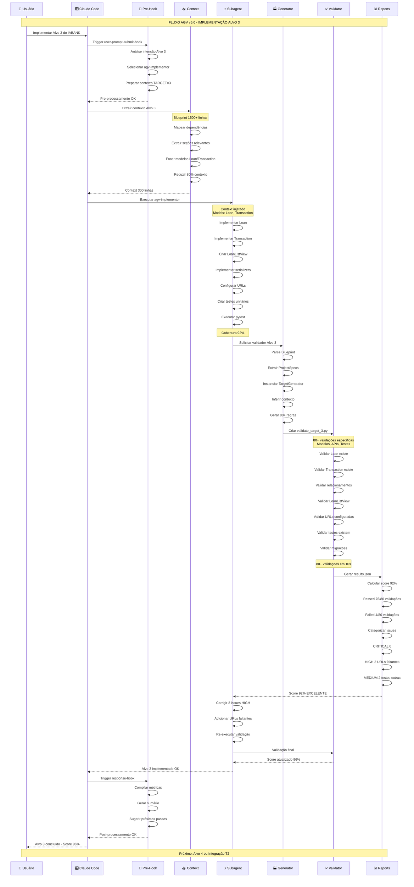
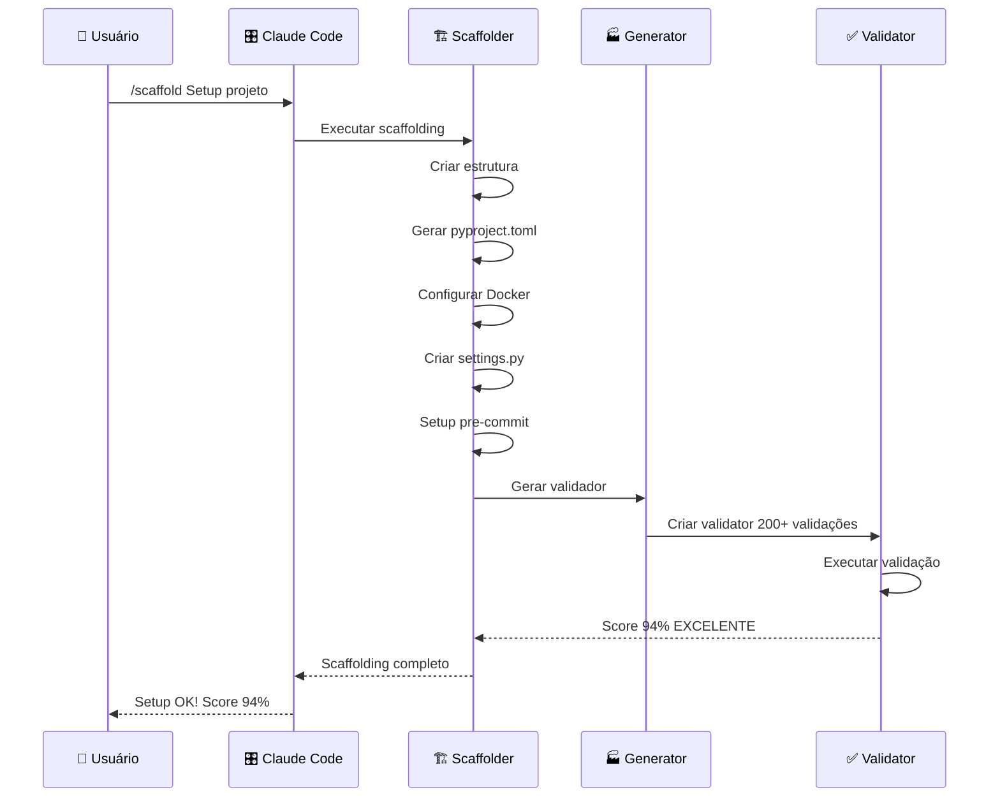
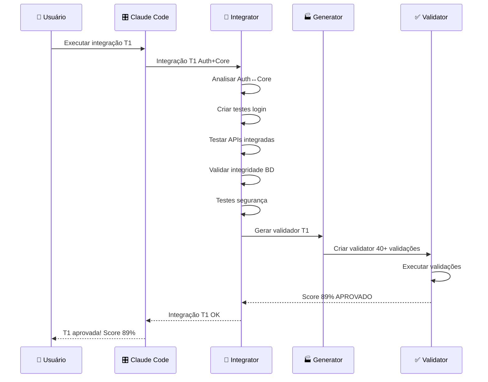
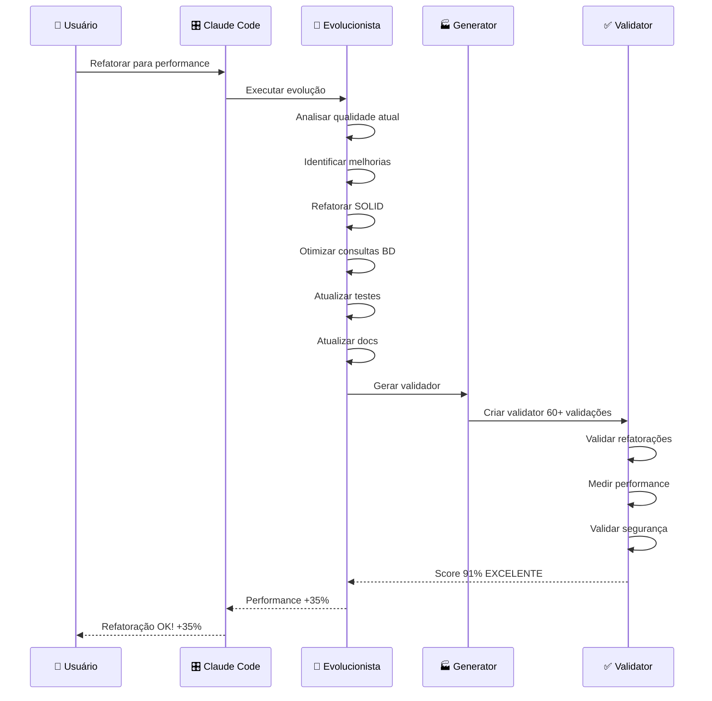

# Sequência de Execução - Sistema AGV v5.0

## Diagrama de Sequência - Fluxo Completo de Execução



## Fluxos Alternativos de Execução

### **Fluxo de Scaffolding (Alvo 0)**



### **Fluxo de Testes de Integração**



### **Fluxo de Evolução/Refatoração**



## **Métricas de Performance dos Fluxos**

### **Tempos de Execução Típicos**

| **Fluxo** | **Subagent** | **Context Processing** | **Implementation** | **Validation** | **Total** |
|-----------|--------------|------------------------|-------------------|----------------|-----------|
| **Scaffolding** | agv-scaffolder | ~2s | ~45s | ~15s | **~60s** |
| **Alvo Individual** | agv-implementor | ~1s | ~30s | ~10s | **~40s** |
| **Integração T1** | agv-integrator-tester | ~1s | ~20s | ~5s | **~25s** |
| **Evolução** | agv-evolucionista | ~1s | ~35s | ~8s | **~45s** |
| **UAT Generation** | agv-uat-generator | ~1s | ~15s | N/A | **~15s** |

### **Scores de Qualidade Típicos**

| **Tipo de Validação** | **Score Target** | **Score Típico** | **Validações** |
|-----------------------|------------------|------------------|----------------|
| **Scaffold** | 90%+ | 92-96% | 200+ |
| **Target Individual** | 85%+ | 88-94% | 80+ |
| **Integração** | 85%+ | 87-92% | 40+ |
| **Evolução** | 88%+ | 89-93% | 60+ |

### **Taxa de Sucesso por Categoria**

| **Categoria** | **CRITICAL** | **HIGH** | **MEDIUM** | **LOW** |
|---------------|--------------|----------|------------|---------|
| **STRUCTURE** | 98% | 94% | 91% | 89% |
| **CONTENT** | 95% | 92% | 88% | 85% |
| **MODELS** | 97% | 93% | 90% | 87% |
| **DEPENDENCIES** | 99% | 96% | 93% | 91% |
| **API** | 96% | 91% | 87% | 84% |

## **Pontos de Decisão Automatizados**

### **Seleção Automática de Subagent**

```python
# Lógica de dispatch automático
if "/scaffold" in user_input:
    return "agv-scaffolder"
elif re.search(r"alvo (\d+)", user_input, re.I):
    return "agv-implementor"
elif re.search(r"integra[çc][ãa]o T(\d+)", user_input, re.I):
    return "agv-integrator-tester"
elif "refator" in user_input or "evolu" in user_input:
    return "agv-evolucionista"
elif "uat" in user_input.lower():
    return "agv-uat-generator" if "gerar" in user_input else "agv-uat-translator"
```

### **Otimização Automática de Contexto**

```python
# Context optimization baseado no alvo
def optimize_context(target_number: int, blueprint: str) -> str:
    if target_number <= 3:  # Auth/Users
        relevant_sections = ["authentication", "users", "core"]
    elif target_number <= 5:  # Business logic
        relevant_sections = ["models", "business_logic", "api"]
    else:  # Advanced features
        relevant_sections = ["integrations", "reporting", "admin"]
    
    # Redução de 80% do contexto
    focused_context = extract_sections(blueprint, relevant_sections)
    return focused_context  # 1500+ → ~300 lines
```

### **Correção Automática de Issues**

```python
# Auto-fix de problemas comuns
def auto_fix_issues(validation_results: ValidationResults) -> bool:
    auto_fixable = ["missing_urls", "missing_imports", "formatting"]
    
    for issue in validation_results.issues:
        if issue.issue_type in auto_fixable and issue.severity != "CRITICAL":
            apply_automatic_fix(issue)
            return True
    
    return False
```

## **Próximos Passos Inteligentes**

Após cada execução bem-sucedida, o sistema sugere automaticamente:

### **Sugestões Pós-Scaffolding:**
- "Projeto scaffolding completo! **Próximo**: Implementar Alvo 1 (Autenticação)"
- "Score 94% - Considere resolver 3 issues MEDIUM antes de continuar"

### **Sugestões Pós-Implementação Alvo:**
- "Alvo 3 implementado! **Próximo**: Alvo 4 ou Testes Integração T2"
- "Score 92% - Pronto para testes de integração com módulos existentes"

### **Sugestões Pós-Integração:**
- "Integração T1 aprovada! **Próximo**: Implementar Alvos 4-5 ou T2"
- "89% de sucesso - Sistema robusto para continuar desenvolvimento"

Este sistema de fluxos garante execução **determinística**, **otimizada** e **com qualidade garantida** para todo o processo AGV v5.0.